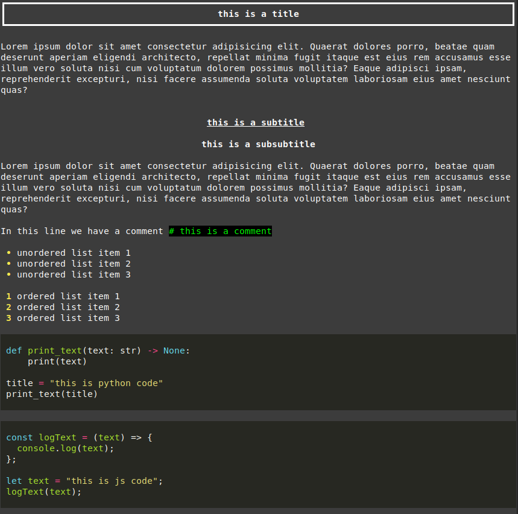

# helpme

Search through your How-to guides.

Have directories (and subdirectories) with all your how-to guides indexed and showed in rich table format.
You can search by name of directory or by the guide name.
Then, by selecting the ID shown in the table you can read the content of the guide with basic formatting.




## Dependencies

- [rich](https://github.com/Textualize/rich)

## Installation

```bash
wget https://raw.githubusercontent.com/lfm-dev/helpme/main/install.sh && bash install.sh
```

## Usage

```bash
helpme query1 query2 ...
helpme all (shows all guides)
```

## Formatting

You can see the format in use in example/example_guide.md

- \# for main titles (bold and underlined)
- \## for subtitles (bold)
- \# (in line) for comments (green)

All guides should be .md files.  
By spliting the file name using underscores you can search through them using individual words.  

